# Mô tả đề tài

Medical Records là một nền tảng web toàn diện giúp bệnh nhân, bác sĩ quản lý các bảng ghi lại một số chỉ sô quan trọng có trong các phiếu xét nghiệm máu để tiện theo dõi. Hệ thống cho phép:

* Bệnh nhân **xem và thêm một số chỉ số quan trọng trong kết quả xét nghiệm máu** 
* Bác sĩ **tìm kiếm, xem xét các bản ghi** và **gửi thông báo đến bệnh nhân**
* Quản trị viên **quản lý tài khoản người dùng** 

Ngoài ra, người dùng còn có thể giao tiếp với AI của Gemini về các vấn đề liên quan đến lĩnh vực y tế.

# Thông tin nhóm
| Họ và tên       | MSSV     | Email                 |
| --------------- | -------- | --------------------- |
| Trương Công Đạt | 22685561 | tdat4926@gmail.com    |
| Nguyễn Gia Lâm  | 22685611 | lam2004ha@gmail.com   |
| han Tấn Tài     | 22684181 | tide.tantai@gmail.com |


# Hướng dẫn cài đặt hoặc sử dụng
## Yêu cầu : Phải cài đặt miniconda trước khi chạy các bước tiếp theo bên dưới.
```bash 
winget install -e --id Anaconda.Miniconda3
```
1.  Clone repo:
    ```bash
    git clone https://github.com/iuh-application-development/Medical-Records.git
    ```
    ```bash
    cd .\Medical-Records\
    ```
## Chạy cơ bản  
2.  Tạo môi trường ảo:
    ```bash
    python -m venv venv
    ```
3.  Kích hoạt môi trường ảo:
    - Đối với Windows:
    ```bash
    venv\Scripts\activate
    ```
    - Đối với Linux/Mac:
    ```bash
    source venv/bin/activate
    ```
4.  Cài đặt các gói phụ thuộc:
    ```bash
    pip install -r requirements.txt
    ```
5.  Chạy ứng dụng:
    ```bash
    python run.py
    ```
## Chạy tự động
```bash
    .\setup-and-run.ps1
```
# Link video

[Link Video Demo] 

# Screenshots
- **Giao diện trò chuyện với AI**
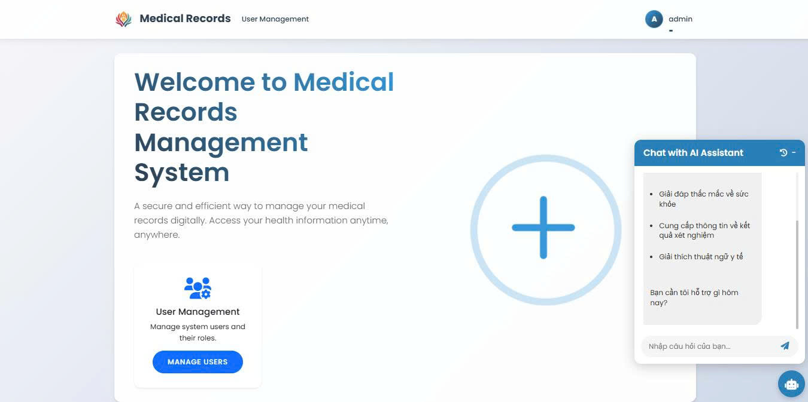 
## Role Patient
- **Tạo bản ghi mới**
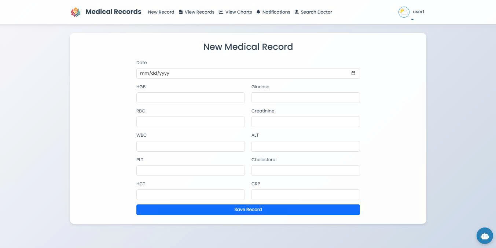 
- **Xem danh sách các bản ghi**
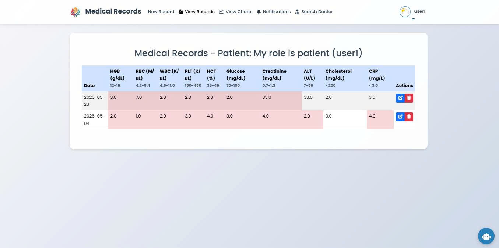 
- **Xem các biểu đồ đường của các bản ghi đã nhập**
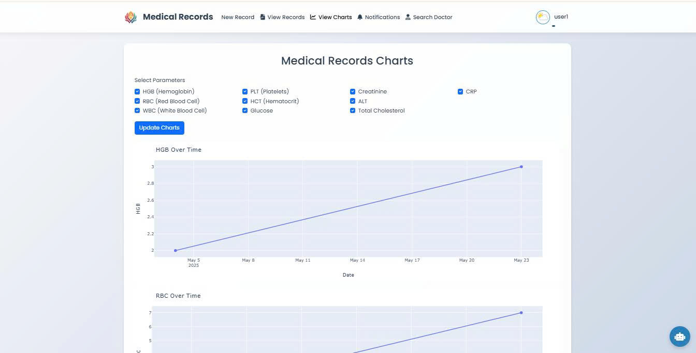
- **Xem thông báo**
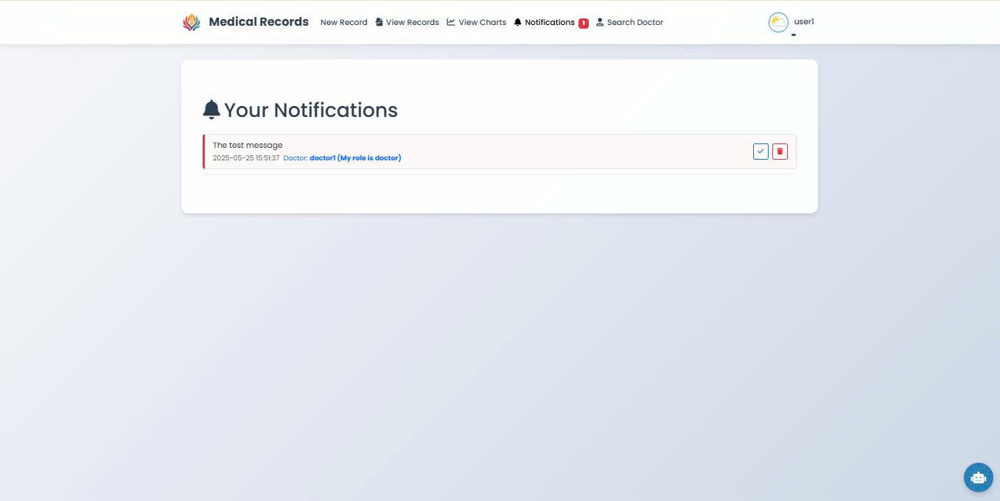
- **Xem thông tin liên lạc của bác sĩ**
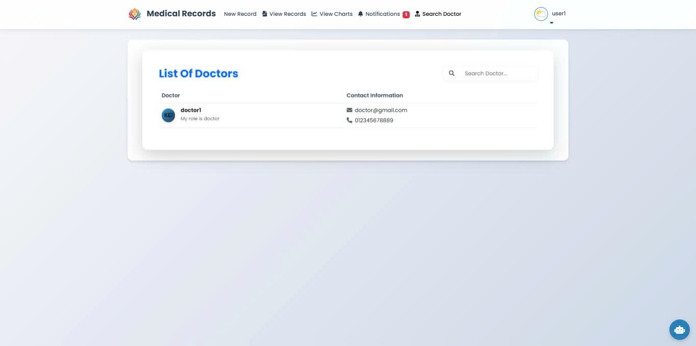 

## Role Doctor
- **Xem danh sách các bệnh nhân**
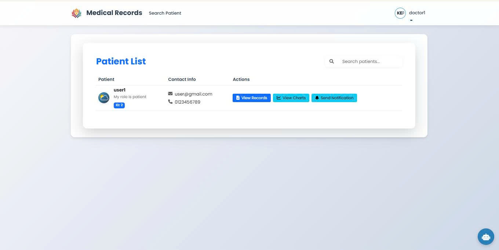 
- **Xem các bản ghi của bệnh nhân đã tạo**
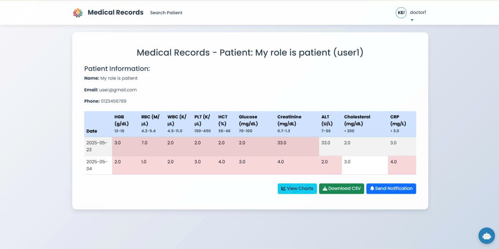 
- **Xem biểu đồ của các bản ghi**
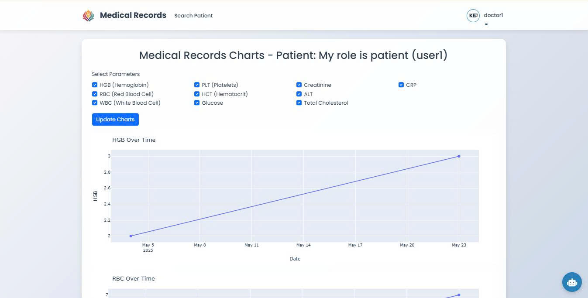 
- **Gửi thông báo cho bệnh nhân**
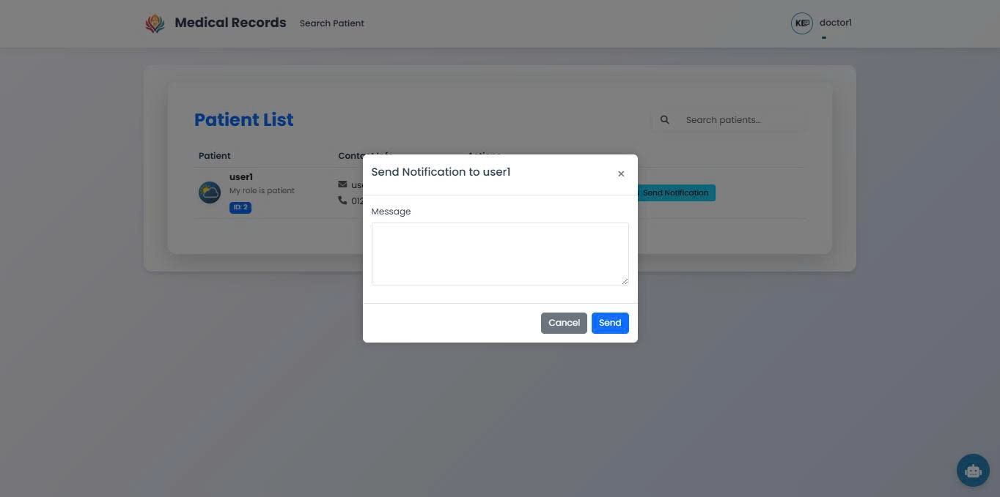

## Role Admin 
- **Giao diện quản lý người dùng**
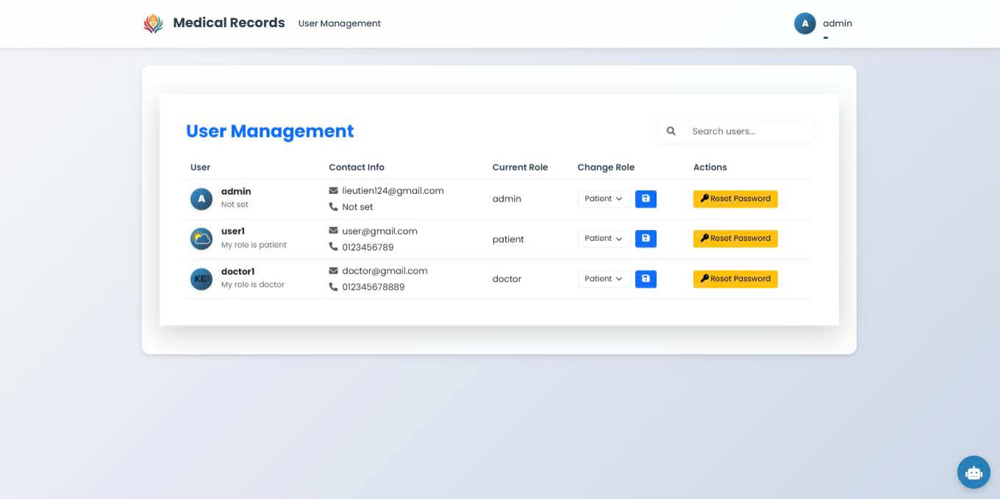 

# Link web đã triển khai: [Medical Record](https://medical-records-pzlf.onrender.com/)